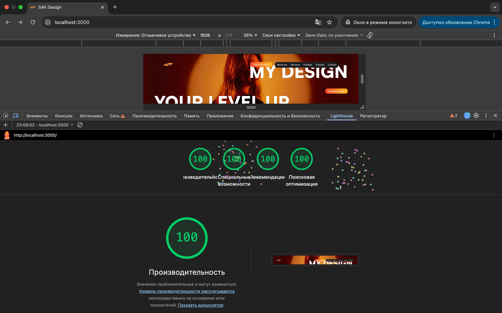
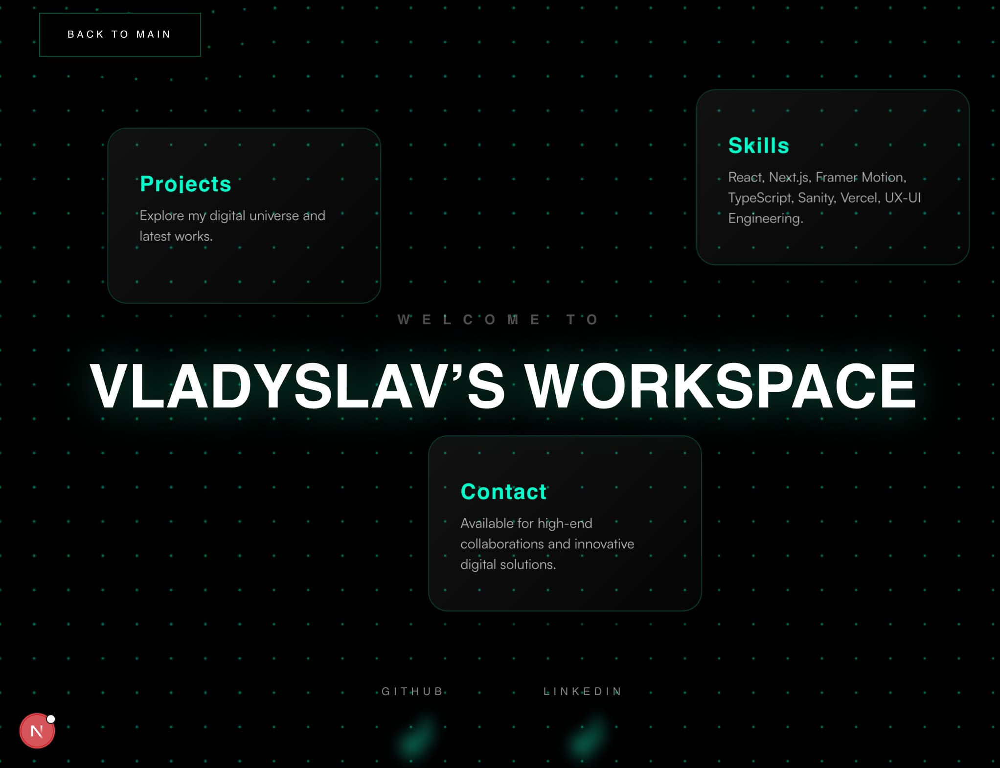
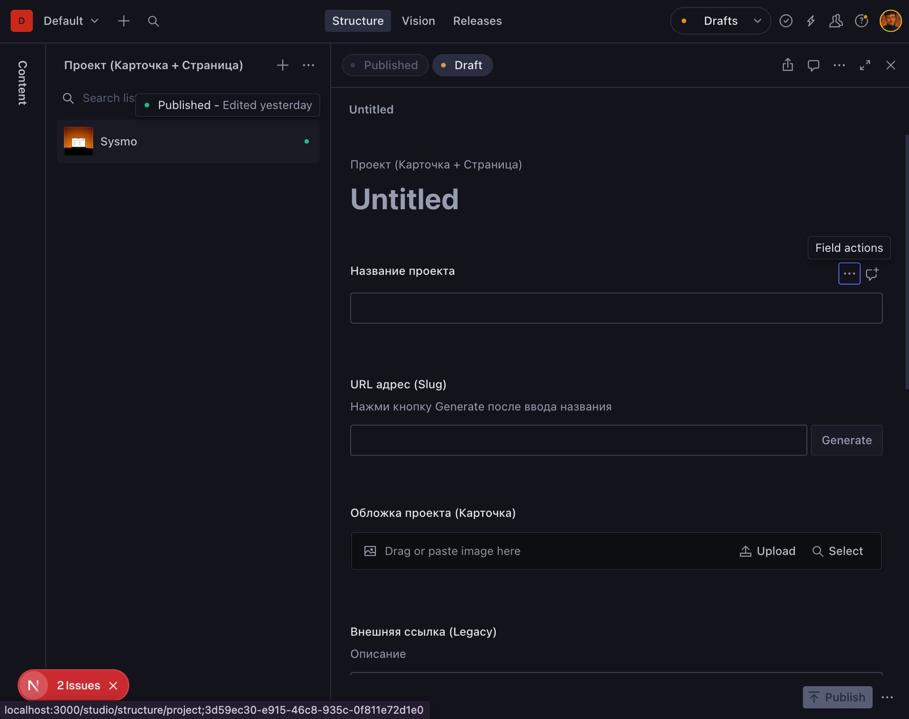
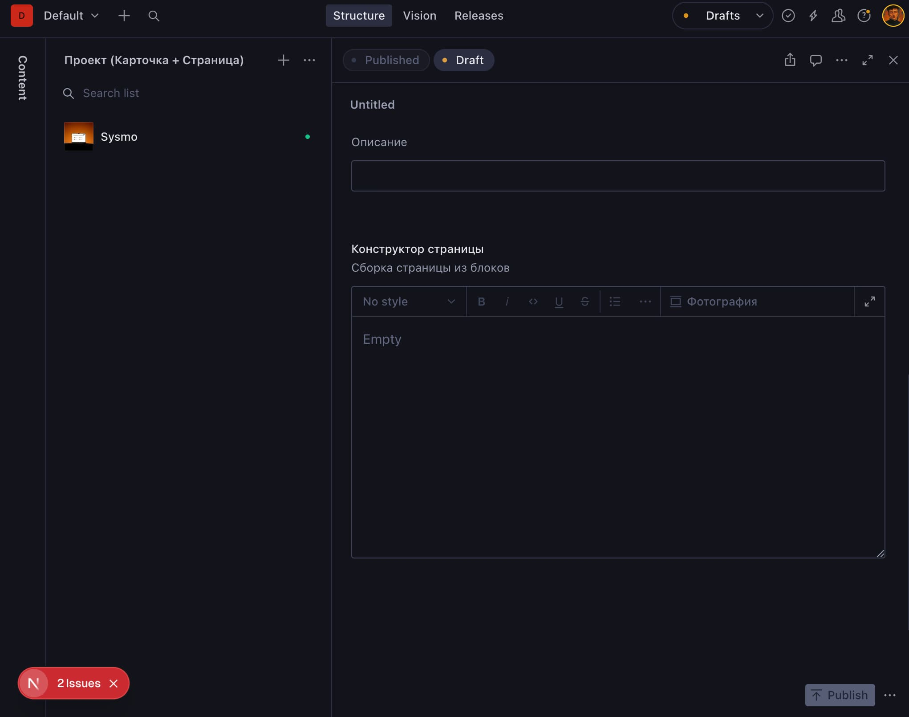
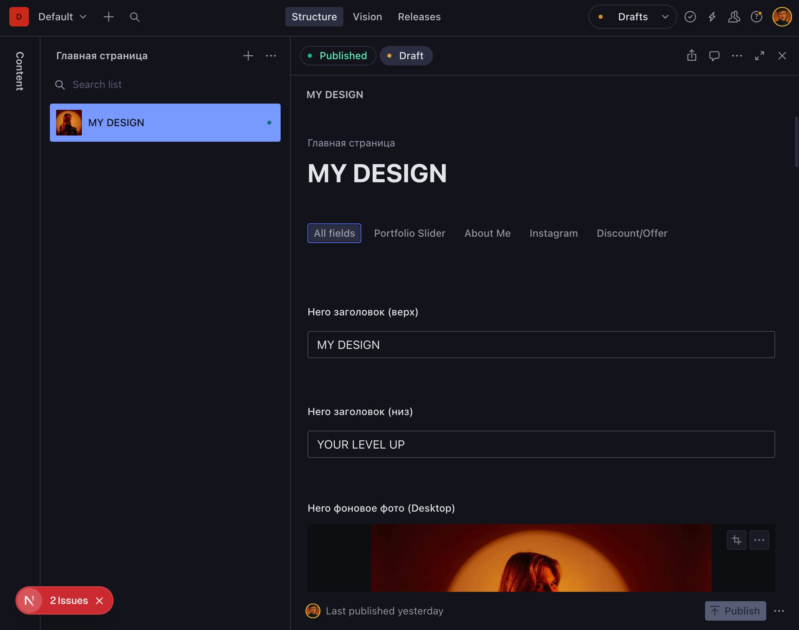

# 🎨 S4K Design Portfolio

## 🔗 Live Links
- **Live Website:** [s4k-design.vercel.app](https://s4k-design.vercel.app)
- **Developer Portfolio:** [Vladyslav Zvezdaiev Profile](https://s4k-design.vercel.app/Vladyslav-zvezdaiev)



Welcome to the official portfolio website for Sonya (S4K Design). This project is a highly optimized, dynamically driven web application tailored to showcase high-end design work, complete with seamless transitions, custom interactive elements, and a dedicated developer hub.



## 🚀 Project Highlights

This application is built for ultimate performance and ultimate client autonomy. It features 9 fully responsive, custom-crafted pages including Services, Process, and a specialized portal for the core developer, Vladyslav Zvezdaiev.

## 🛠️ Core Features

<details>
<summary><b>✨ No-Code Content Management (Sanity CMS)</b></summary>

The client has complete control over their portfolio without needing to touch a single line of code. Below is a glimpse into the custom studio configured for this project.

**Visual Page Builder & Constructor**





**Main Page Content Editor**



- **Dynamic Sliders:** Easily swap out portfolio images, update project titles, and manage slider content directly from the Sanity Studio interface.
- **Automated Routing:** Creating a new project in the CMS automatically generates a dedicated, SEO-friendly page with proper routing.
- **Live Updates:** Content is updated in real-time, allowing the client to maintain a fresh and relevant portfolio effortlessly.

</details>

<details>
<summary><b>🏗️ Feature-Sliced Design (FSD) Architecture</b></summary>

The codebase is structured using the Feature-Sliced Design methodology, ensuring maximum scalability and maintainability.

- **App:** Global settings, routing, and foundational providers.
- **Pages:** Compositional layers for all 9 distinct routes.
- **Widgets:** Complex standalone blocks like Headers, Footers, and Portfolio Sliders.
- **Entities:** Business logic and UI components for specific domains (e.g., ProjectCard).
- **Shared:** Reusable UI elements, API configurations, and global SCSS variables.

</details>

<details>
<summary><b>⚡ Peak Performance (100/100 Lighthouse)</b></summary>

Optimized for the modern web. The site achieves perfect scores across the board.

- Next.js Server-Side Rendering (SSR) and Static Site Generation (SSG).
- Optimized image loading and asset delivery.
- Seamless state management and component hydration.

</details>

<details>
<summary><b>👨‍💻 Dedicated Developer Portal</b></summary>

A unique ecosystem within the app. The `/Vladyslav-zvezdaiev` route serves as a dedicated space to showcase the engineering muscle behind the design, featuring complex interactive elements and structural deep dives.

</details>

<details>
<summary><b>🎨 Advanced UI/UX Interactions</b></summary>

- Custom drag-and-drop zones.
- Smooth fade-in animations and transition overlays.
- Responsive design that adapts flawlessly from desktop landscape down to mobile.

</details>

## 💻 Tech Stack

- **Framework:** Next.js
- **Language:** TypeScript
- **Styling:** SCSS Modules
- **CMS:** Sanity
- **Architecture:** Feature-Sliced Design (FSD)

## 📂 Project Structure

```text
s4k-design/
├── public/
│   ├── benefits/
│   ├── card/
│   ├── drag-and-drop/
│   ├── icons/
│   ├── myInst/
│   ├── pages/
│   ├── shared/
│   └── sysmo/
├── sanity/
│   ├── lib/
│   └── schemaTypes/
├── src/
│   ├── app/
│   │   ├── About/
│   │   ├── Contact/
│   │   ├── Portfolio/
│   │   ├── Process/
│   │   ├── Services/
│   │   │   ├── Branding/
│   │   │   └── UX-UI/
│   │   ├── studio/
│   │   │   └── [[...tool]]/
│   │   ├── Sysmo/
│   │   └── Vladyslav-zvezdaiev/
│   ├── entities/
│   │   └── project/
│   │       ├── model/
│   │       └── ui/
│   │           └── ProjectCard/
│   ├── shared/
│   │   ├── api/
│   │   ├── config/
│   │   ├── fonts/
│   │   │   └── satoshi/
│   │   ├── lib/
│   │   ├── styles/
│   │   └── ui/
│   │       ├── Button/
│   │       ├── Fade-in/
│   │       ├── Icon/
│   │       │   └── Network/
│   │       ├── Modal/
│   │       ├── PageLoader/
│   │       │   └── ui/
│   │       └── TransitionOverlay/
│   └── widgets/
│       ├── layout/
│       │   ├── Footer/
│       │   │   └── ui/
│       │   ├── Header/
│       │   │   └── ui/
│       │   └── Hero/
│       │       └── ui/
│       └── pages/
│           ├── BrandIdentityPage/
│           │   ├── BenefitsSection/
│           │   ├── Hero/
│           │   └── ProcessSection/
│           ├── ContactMePage/
│           │   ├── ContactHero/
│           │   └── ContactNav/
│           ├── MainPage/
│           │   ├── AboutMeSection/
│           │   ├── DiscountSection/
│           │   ├── MyInstagramSection/
│           │   └── PortfolioSliderSection/
│           ├── PortfolioPage/
│           │   ├── BrandPortfolioSection/
│           │   └── Hero/
│           ├── ProcessPage/
│           │   ├── DragAndDropSection/
│           │   ├── Hero/
│           │   ├── MattersSection/
│           │   └── ProcessSection/
│           ├── SysmoPage/
│           │   ├── Hero/
│           │   └── SysmoPhotoSection/
│           ├── UXUiPage/
│           │   ├── BenefitsSection/
│           │   ├── Hero/
│           │   └── ProcessSection/
│           ├── VladyslavsPage/
│           │   └── ui/
│           └── WhoIAmPage/
│               ├── Hero/
│               ├── Hi/
│               ├── MyExperience/
│               └── ValuesInspiration/